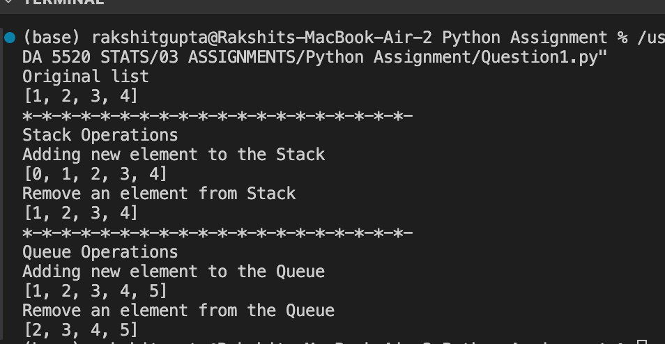
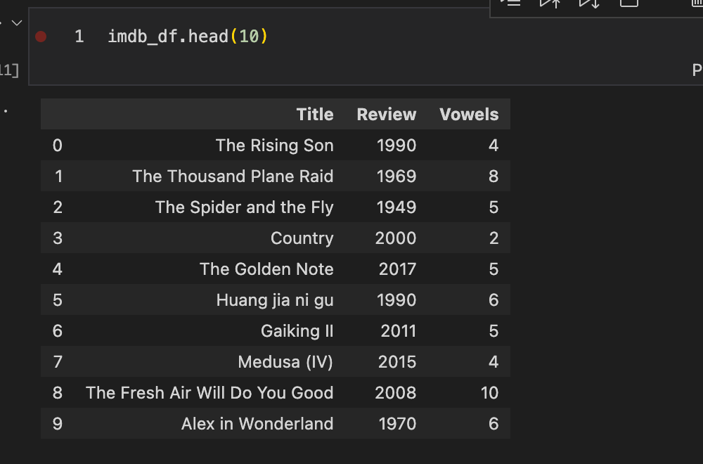
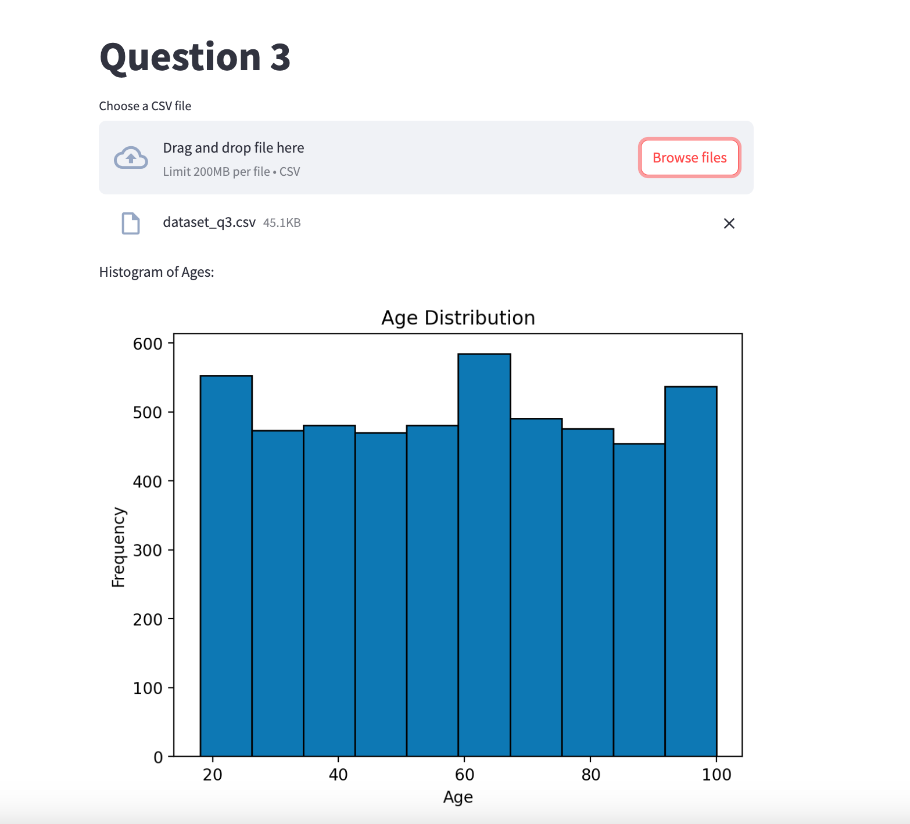

## MCDA 5520 Assignment 

To set up environment to run the following code for question 2 and 3 and activate it.
```conda env create -f environment.yml```

Question1: Implement basic add and remove operation of stack and queue using list. 

### Output:



Question2: Count the number of vowels for a column in pandas dataframe. 

### Output:



Question3: Create a application using streamlit where we can upload a csv file and plot histogram of 'Age' column. 

### Output:

To run the application 

``` streamlit run Question3.py```

